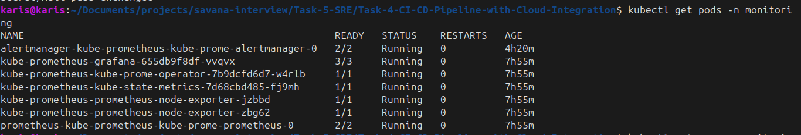
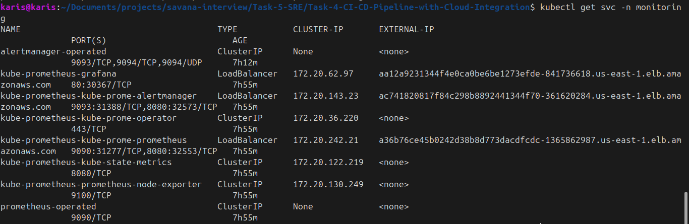
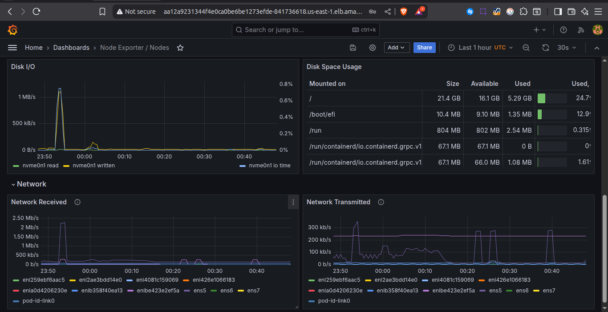
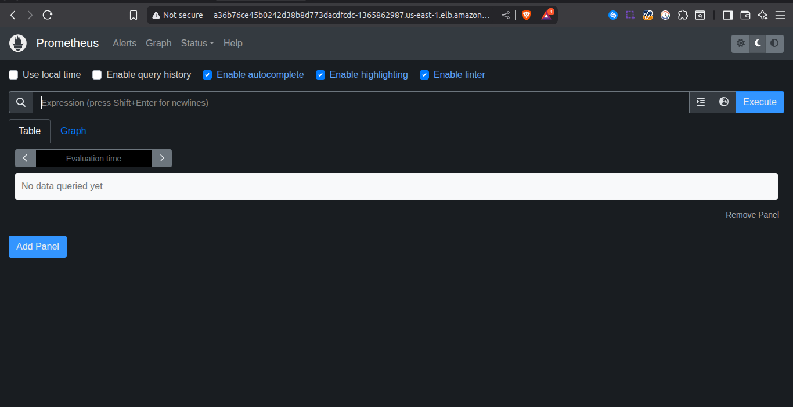
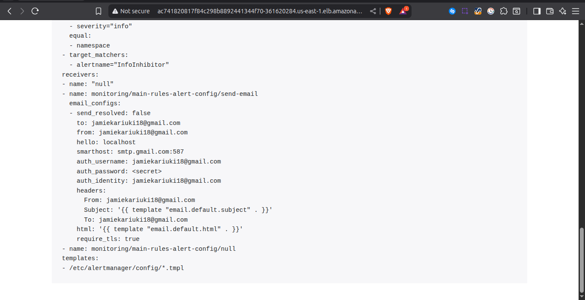

# Task 5: Site Reliability Engineering (SRE)

## 1. Monitoring Stack Setup

I installed the **Kube-Prometheus-Stack** using Terraform + Helm, which deploys the following components in the `monitoring` namespace:

- **Prometheus** → Collects and stores metrics
- **Grafana** → Visualization dashboards for system and app performance
- **Alertmanager** → Routes alerts to email and manages silencing/inhibition

  **Pods running**
  (`kubectl get pods -n monitoring` showing Prometheus, Grafana, Alertmanager running)
  

  **Services Running**
  (Screenshot of `kubectl get svc -n monitoring` showing LoadBalancer services for Prometheus, Grafana, and Alertmanager)
  

**User Interfaces**
(Screenshots of Prometheus UI, Grafana dashboards, and Alertmanager UI)

Grafana



---

prometheus



---

Alert manager



## 2. Alert Configuration

I created **custom alerting rules** to detect critical issues in the application and infrastructure.

### PrometheusRule (Alert Definitions)

```yaml
apiVersion: monitoring.coreos.com/v1
kind: PrometheusRule
metadata:
  name: custom-alert-rules
  namespace: monitoring
  labels:
    release: kube-prometheus-stack
spec:
  groups:
    - name: custom.rules
      rules:
        - alert: HighCpuUsage
          expr: 100 - (avg by(instance) (rate(node_cpu_seconds_total{mode="idle"}[5m])) * 100) > 80
          for: 10m
          labels:
            severity: warning
            team: sre
          annotations:
            summary: "High CPU usage on {{ $labels.instance }}"
            description: "CPU usage is above 80% for more than 10 minutes (current: {{ $value }}%)."

        - alert: CrashLooping
          expr: increase(kube_pod_container_status_restarts_total[10m]) > 3
          for: 5m
          labels:
            severity: critical
            team: sre
          annotations:
            summary: "Pod crash loop detected in namespace {{ $labels.namespace }}"
            description: "Pod {{ $labels.pod }} has restarted more than 3 times in the last 10 minutes."

        - alert: AppDown
          expr: kube_endpoint_address_available{endpoint="frontend"} < 1
          for: 1m
          labels:
            severity: critical
          annotations:
            summary: "Application down"
            description: "No healthy endpoints available for service frontend"
```

---

### AlertmanagerConfig (Routing & Notification)

```yaml
apiVersion: monitoring.coreos.com/v1alpha1
kind: AlertmanagerConfig
metadata:
  name: main-rules-alert-config
  namespace: monitoring
  labels:
    release: kube-prometheus-stack
spec:
  route:
    repeatInterval: 30m
    receiver: "null"
    routes:
      - matchers:
          - name: alertname
            value: HighCpuUsage
        receiver: "send-email"
      - matchers:
          - name: alertname
            value: CrashLooping
        receiver: "send-email"
      - matchers:
          - name: alertname
            value: AppDown
        receiver: "send-email"
        repeatInterval: 5m

  receivers:
    - name: "send-email"
      emailConfigs:
        - to: jamiekariuki18@gmail.com
          from: jamiekariuki18@gmail.com
          sendResolved: false
          smarthost: smtp.gmail.com:587
          authUsername: jamiekariuki18@gmail.com
          authIdentity: jamiekariuki18@gmail.com
          authPassword:
            name: mail-pass
            key: gmail-pass
    - name: "null"
```

### Secret for Email Authentication

```yaml
apiVersion: v1
kind: Secret
type: Opaque
metadata:
  name: mail-pass
  namespace: monitoring
  labels:
    release: kube-prometheus-stack
data:
  gmail-pass: <base64-encoded-password>
```

These configurations ensure:

- **HighCpuUsage** → Alerts when CPU > 80% for 10 minutes
- **CrashLooping** → Alerts if pods restart > 3 times in 10 minutes
- **AppDown** → Alerts if the frontend/backend service has no healthy endpoints

All alerts are routed through Alertmanager, which sends notifications via email.

---

## 3. Incident Response Procedures

To align with SRE principles, I defined **basic incident response steps**:

1. **Alert Triggered** → Alertmanager sends email notification.
2. **Triage** → On-call engineer checks Grafana dashboards and Prometheus metrics to validate the alert.
3. **Diagnosis** → Identify root cause:

   - High CPU → Scale application or optimize queries
   - CrashLooping → Check pod logs (`kubectl logs`) for errors
   - AppDown → Validate Kubernetes service/Ingress and check pod health

4. **Resolution** → Apply a fix (restart pod, scale resources, fix config).
5. **Postmortem** → Document the incident and preventive actions.

---

## Problems Faced & Solutions

1. **Issue:** Alertmanager pod was not visible when checking with `kubectl get pods`.

   - **Cause:** Used wrong deployment name (`kube-prometheus-kube-prome-alertmanager`) instead of the one installed by Helm.
   - **Fix:** Checked with `kubectl get pods -n monitoring` and used the correct pod name from Helm release.

2. **Issue:** Email notifications were not being sent.

   - **Cause:** Gmail SMTP requires app passwords, not the normal account password.
   - **Fix:** Created a Gmail App Password, stored it in Kubernetes Secret (`mail-pass`), and referenced it in the config.

3. **Issue:** Alerts did not fire during testing.

   - **Cause:** Conditions in PrometheusRule (e.g., CPU usage > 80%) were not being met.
   - **Fix:** Simulated conditions by deleting pods and scaling workloads up to trigger **CrashLooping** and **AppDown** alerts.

4. **Issue:** Confusion between default alerts and custom alerts.

   - **Cause:** `kube-prometheus-stack` already ships with a wide range of default rules.
   - **Fix:** Kept defaults but added a few custom rules (CPU, crashloop, downtime) for demonstration and clarity.
