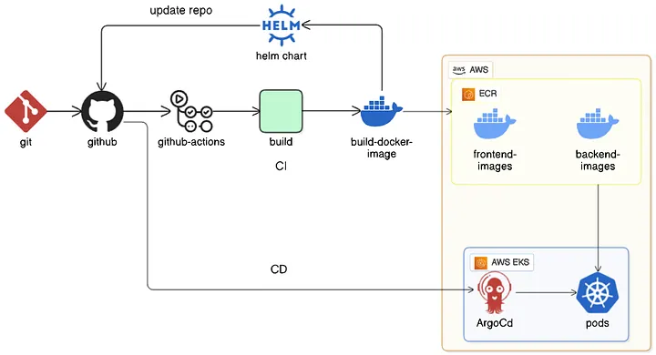
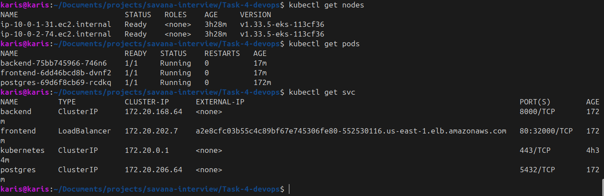
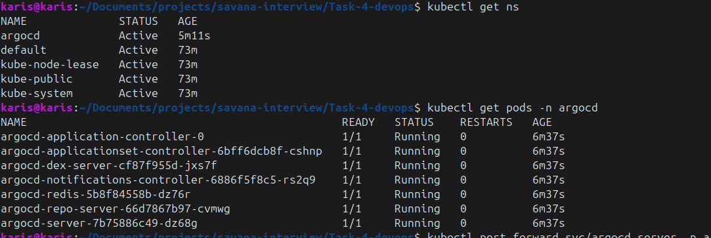
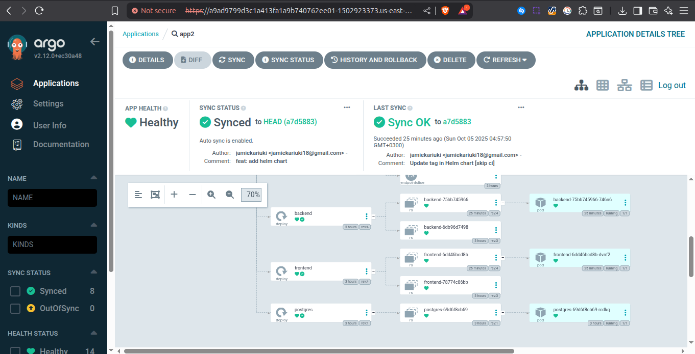
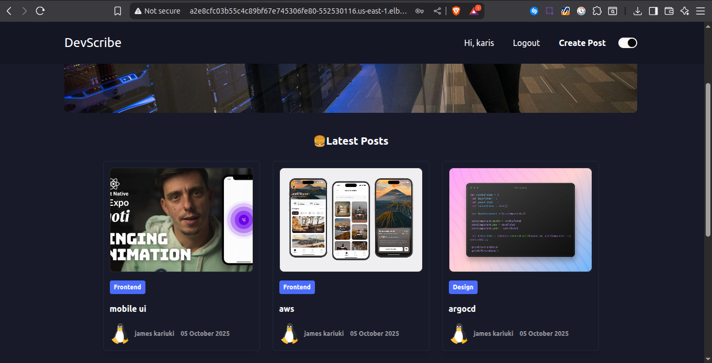

# Task 4: CI/CD Pipeline with Cloud Integration (DevOps and Cloud Engineering: react, django and postgress)

## Objective

The goal of this project was to design and implement a **CI/CD pipeline** that:

- Deploys a 3 tier application (React, django and postgres db)
- Builds and tags application containers.
- Pushes container images to a **container registry** (AWS ECR).
- Deploys the application to a **Kubernetes cluster (AWS EKS)**.
- Uses **ArgoCD** for GitOps-based continuous delivery.

This implementation leverages **GitHub Actions** for CI/CD automation and **Terraform** for infrastructure provisioning.

---

## Pipeline Workflow

The pipeline automates the following stages:

1. **Code Commit & Trigger**

   - Developer pushes code to the `main` branch.
   - GitHub Actions pipeline is triggered.

2. **Versioning**

   - Semantic versioning script checks commit messages and bumps version (e.g., `frontend-v0.1.1`).
   - New git tags are automatically created and pushed.

3. **Build & Push**

   - Docker images are built for `frontend` and `backend`.
   - Tagged images are pushed to **Amazon ECR**.

4. **Update Helm Values**

   - GitHub Actions updates Helm values (`values.yaml`) with the new image tags and repository URLs.

5. **Continuous Deployment (CD)**

   - **ArgoCD** monitors the Git repository for Helm chart changes.
   - On detecting changes, ArgoCD syncs the latest manifests to the EKS cluster.

6. **Verification**

   - Pods and services are checked to confirm the deployment.
   - ArgoCD UI shows healthy state of the applications.
   - Application is verified running in browser.

---

## CI/CD Pipeline Diagram

Below is a high-level diagram of the pipeline process:



---

## Infrastructure

- **Terraform** provisions:

  - AWS EKS Cluster
  - AWS ECR Repositories (frontend & backend)
  - Networking (VPC, subnets, security groups)

- **Kubernetes + Helm**:

  - Helm manages manifests for frontend & backend apps.
  - Services expose the applications inside the cluster.

- **ArgoCD**:

  - Monitors GitHub repo for manifest changes.
  - Syncs updates automatically to EKS.

---

## Deployment Verification

1. **Check running pods and services**

   ```bash
   kubectl get nodes
   kubectl get pods
   kubectl get svc
   ```

   

2. **ArgoCD Sync Status (CLI)**
   

3. **ArgoCD Web UI**
   

   - Shows healthy deployment status of frontend & backend.
   - Confirms GitOps automation working correctly.

4. **Application Running in Browser**
   

---

## Environment Handling

- All sensitive values (AWS keys, account ID, ECR repo URLs) are managed via **GitHub Secrets**.
- Terraform outputs (ECR URLs, cluster info) are stored in **S3 backend** and loaded in the pipeline.
- Versioning and tagging are automatically handled based on commit messages.

---

## Bonus: Infrastructure-as-Code in Pipeline

- The pipeline integrates **Terraform provisioning**:

  - Runs as a prerequisite workflow.
  - Ensures EKS cluster and ECR are provisioned before application CI/CD.
  - Outputs (ECR URLs, cluster details) are dynamically consumed by GitHub Actions.
